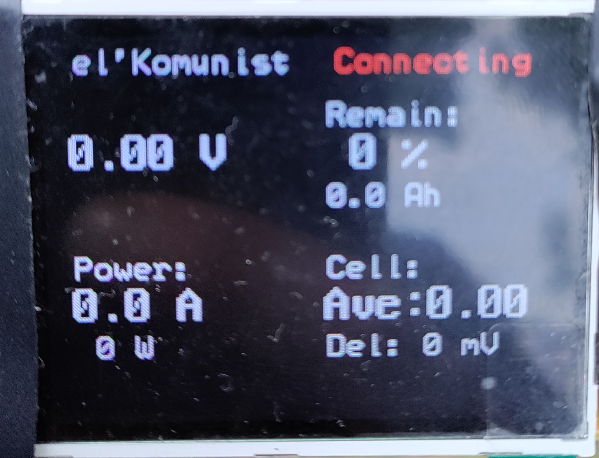
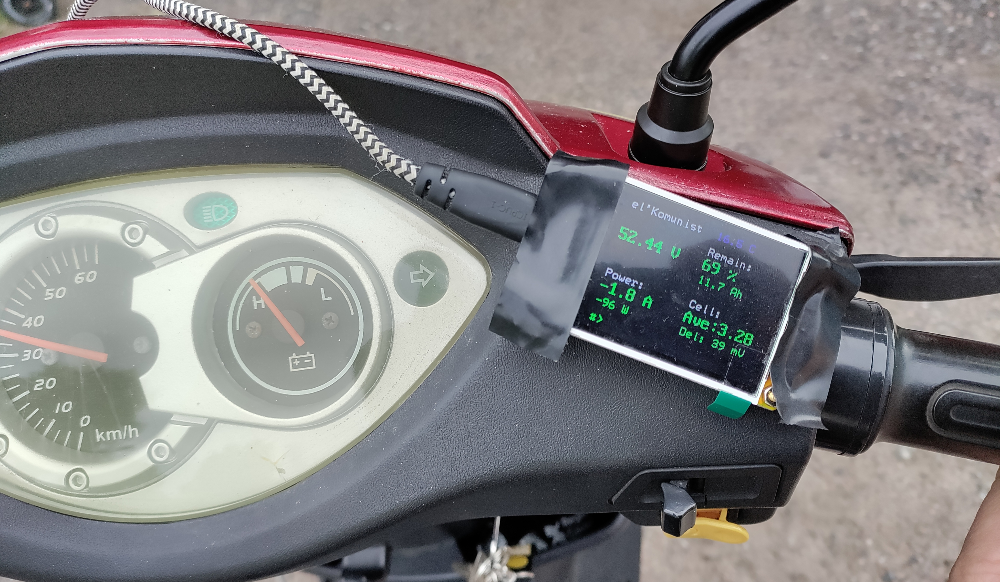
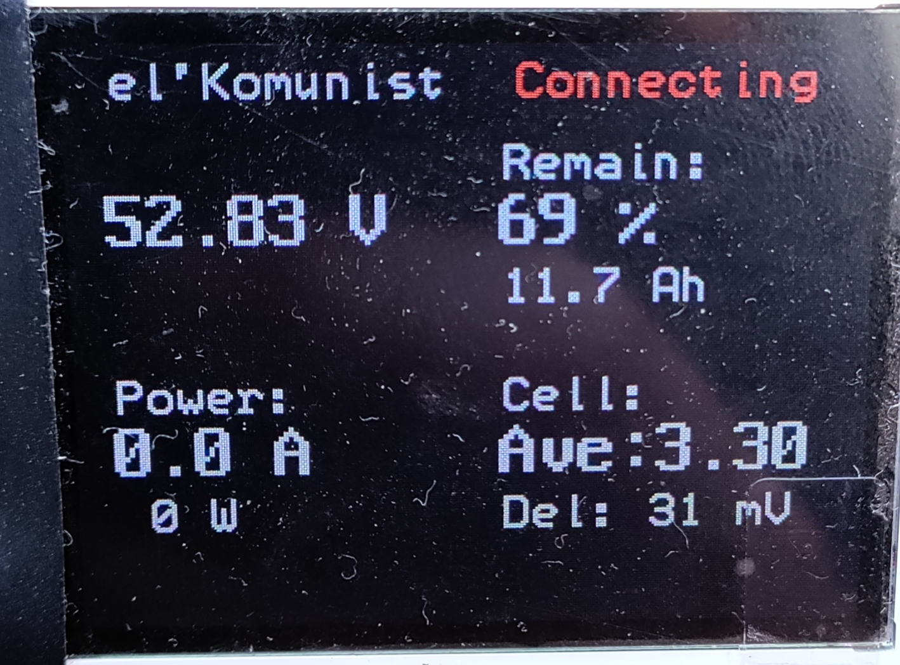

# CYD JK-BMS Monitor v2

A simple real-time battery monitor for the **ESP32 Cheap Yellow Display (CYD, non-touch)** using Bluetooth Low Energy (BLE) to communicate with a **JK-BMS**.

The project displays the most important battery information directly on the 2.2" display without requiring a mobile phone.

Developed and tested with:

* **CYD (ESP32-2432S022, non-touch)**
* **JK-BD4A17S4P**
* Hardware **V11.XW**
* Software **V11.27**

---

## Features

Displays real-time information from the JK-BMS, including:

* Pack voltage
* Charge / discharge current
* Battery power (W)
* State of Charge (SOC)
* Remaining capacity (Ah)
* Average cell voltage
* Cell voltage difference (Δ)
* Battery temperature 1 and 2
* Alarm code and alarm description
* Bluetooth connection status

The display automatically reconnects if the BLE connection is lost while keeping the last received values visible.

---

## Screenshots

### Startup / Connecting



---

### Connected

Example while the vehicle is consuming approximately **1.5 A**.



---

### Connection Lost / Reconnecting

When the BLE connection is lost, the display indicates the reconnect process while keeping the last received battery values visible.



---

## Supported Hardware

Currently tested with:

| Device                                 | Status |
| -------------------------------------- | ------ |
| ESP32 Cheap Yellow Display (non-touch) | ✅      |
| JK-BD4A17S4P                           | ✅      |
| Hardware V11.XW                        | ✅      |
| Firmware V11.27                        | ✅      |

Other JK-BMS models using the same BLE protocol may also work but have not been tested.

---

## Power Supply

The monitor is intended to power up automatically when the vehicle ignition is switched on.

For a 48 V battery system, the CYD can be powered from a DC-DC buck converter.

Tested with:

* **DC-DC 12–120 V to 1.5–48 V Adjustable Step-Down Module**
* Input: 48 V battery pack
* Output: Adjusted to **5.0 V**
* Connected to the CYD via the USB-C connector or 5 V input.

This allows the display to start automatically with the vehicle and shut down when the ignition is turned off, eliminating the need for a separate battery or manual power switch.

> **Important:** Always verify the converter output is adjusted to **5.0 V** before connecting the CYD. Applying a higher voltage may permanently damage the ESP32 display.


## Installation

### Clone the repository

```bash
git clone https://github.com/hemskgren/cyd_jk-bms-v2.git
```

or download the project as a ZIP from GitHub.

### Arduino IDE

Open the project folder in the Arduino IDE.

Install the required ESP32 board support and libraries if they are not already installed.

Select your ESP32 board and upload the sketch to the CYD.

---

## First Start

After power-up the display will:

1. Start Bluetooth scanning.
2. Search for the configured JK-BMS.
3. Connect automatically.
4. Begin displaying live battery information.

If the connection is interrupted, the monitor automatically starts scanning and reconnects when the BMS becomes available again.

---

## Notes

* The project is intended as a lightweight stand-alone battery monitor.
* No mobile phone is required during normal operation.
* The last received battery data remains visible if the Bluetooth connection is temporarily lost.
* Alarm values are shown both as the raw numeric value and as a descriptive text whenever known.

---

## License

This project is provided as-is without any warranty.

Use at your own risk.
